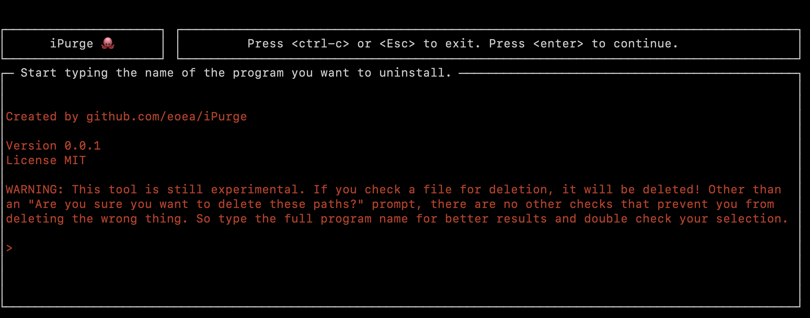
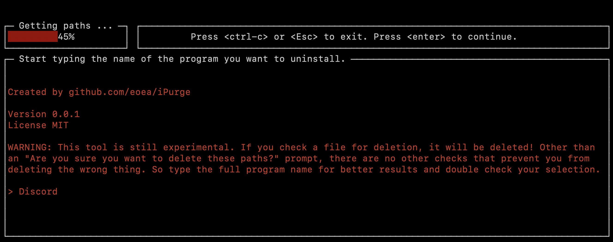
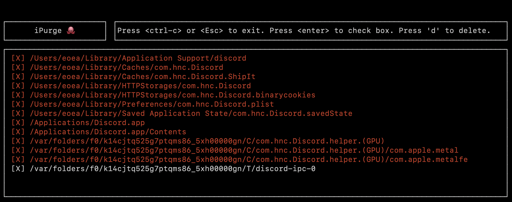
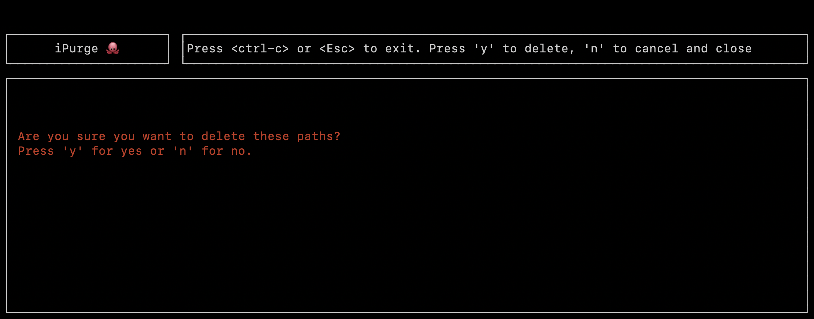
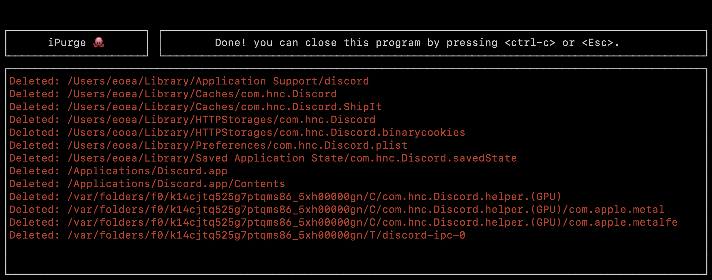

# README

ipurge is a TUI program that uninstalls apps on Mac OS. This program is still
experimental. It is recommended that you only search for applications that you
have installed and not the default applications that are installed by Apple. 

WARNING: Please make sure to carefully read the file path that is identified as
"to be deleted" by the program. Only pass full names of an application you want
to remove. If you are unsure if the path is related to what you want to remove, 
do not use this program. Read the License.

## Installation

- Clone the repository.
- Inside the repository run `make build`. This will install the `ipurge` program
    in `$HOME/.local/bin`, create this directory if it doesn't exist or change
    the path in the Makefile.

## Usage

- Run `ipurge`. Follow the instructions in the UI.

### Home Screen

### User Passes Input And Runs

### Selection Of Paths For Deletion

By default the file paths will be 'unchecked' for deletion to force you to check
them one by one. There is no select-all option. Use the 'Up' and 'Down' arrow
keys or 'k' and 'j' for movement.

### Prompt To Confirm Deletion

### Final Screen That Shows Which Paths Have Been Deleted

If a file path cannot be deleted by the program then the description will say
`Skipped: ...` instead of `Deleted: ...`.

